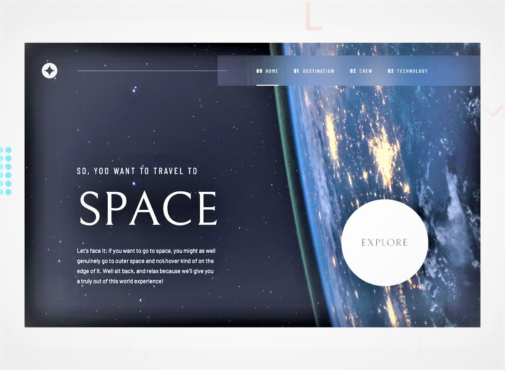

# Frontend Mentor - Space Tourism Website 🚀



## Welcome! 👋

This project is part of a **Frontend Mentor challenge**, designed to improve coding skills by building realistic projects. The goal is to create a **multi-page space tourism website** while ensuring responsiveness across different screen sizes.

### **🛠️ Technologies Used**
- **HTML & CSS**
- **Tailwind CSS** (for utility-first styling)
- **JavaScript Fetch API** (to load dynamic data from `data.json`)

## 🌟 The Challenge

The challenge was to **build out this website** and get it looking as close to the provided design as possible. Users should be able to:

- View the **optimal layout** for each page depending on screen size.
- See **hover states** for all interactive elements.
- Toggle between tabs to view **new destination information** dynamically.

This project was built with **Tailwind CSS** for styling and uses the **Fetch API** to retrieve data from `data.json`, making the pages dynamic.

---

## 📂 Where to Find Everything

- All required assets are in the `/assets` folder.
- The project uses a **design system** for consistent colors, fonts, and styles.
- The **data.json** file provides structured information for each space destination.

---

## 🚀 Deployment

This project is hosted on **GitHub Pages**. You can check out the live version here:  
👉 **[Live Demo](https://github.com/ParthaDey5/space-tourism-website-main.git)**  

---

## 🔥 How to Run Locally

To view this project on your local machine:

```sh
git clone https://github.com/ParthaDey5/space-tourism-website-main.git
cd YOUR-REPOSITORY
